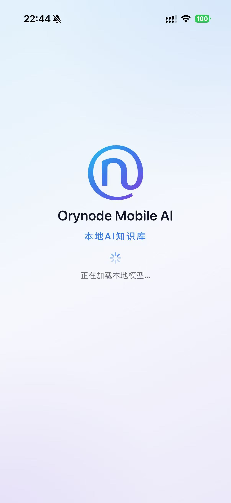
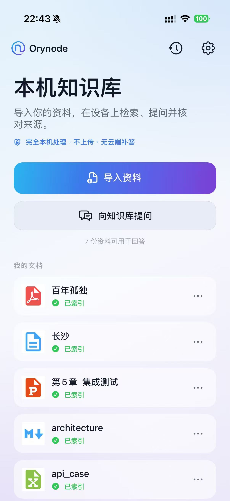
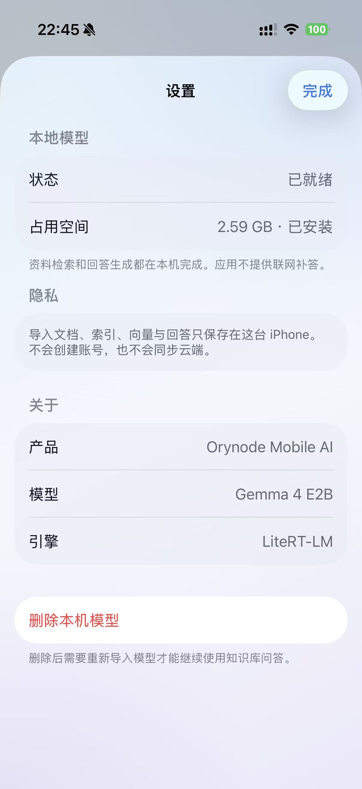

# iOS

Orynode Mobile AI 原生客户端（SwiftUI），定位为严格离线、本机知识库优先的手机 AI。多平台规划见仓库根目录 [README.md](../README.md)。

技术基线：Gemma 4 E2B + Google LiteRT-LM Swift API（Metal）。验证设备：iPhone 16 Pro（8 GB）。  
当前版本见 [CHANGELOG.md](./CHANGELOG.md)（营销版本与 `project.yml` 的 `MARKETING_VERSION` 一致）。

<p align="center">
  
  
  
  
</p>

<p align="center"><sub>欢迎页 · 知识库 · 问答 · 设置</sub></p>

## 生成工程

```bash
brew install xcodegen
cd ios
./scripts/bootstrap-litertlm.sh   # 拉取固定 tag 的 LiteRT-LM → .tools/（gitignore）
xcodegen generate
open OrynodeMobileAI.xcodeproj
```

`project.yml` 是工程配置的唯一事实来源。随后在 Xcode 选择开发团队并连接真机。模型权重不进 Git：自行准备 `gemma-4-E2B-it.litertlm`，经 Files / Finder 导入。

`ios/.tools/LiteRT-LM` 是本机源码树（bootstrap 后**不含**嵌套 `.git`），**不要** `git add`，也**不要**推到本仓库。若 IDE 仍显示 LiteRT-LM 仓库，重载窗口；或删掉 `ios/.tools` 后重新执行 `./scripts/bootstrap-litertlm.sh`。

## 当前能力（摘要）

- Files 安全导入 `.litertlm`；Metal 主推理
- 导入 TXT、Markdown、文本型 PDF、Office Open XML（docx / xlsx / pptx）
- 扫描 PDF：无文字层页面本机 Vision OCR 后进入同一索引流水线
- SQLite FTS5 + Accelerate 精确向量混合检索；10,000 chunks 硬上限
- 复制进 sandbox 后立即入列；分批索引可中断恢复；失败可按原文档 ID 重试
- 本机知识库问答、证据不足拒答、引用跳转与来源片段查看
- SHA-256 内容去重；embedding / 检索 / 切分 / 哈希版本闸门
- 真机飞行模式下核心路径可用（导入 → 索引 → 提问 → 引用）
- Vision OCR 基础设施（扫描 PDF 空页回退；拍照产品入口未启用）
- Domain / Application / Infrastructure 独立 framework，编译期单向依赖

尚未宣称发布完成（见 [architecture.md](docs/architecture.md) §10 与 [verification.md](docs/verification.md)）：预注册题集闸门、10k 真机容量/恢复与内存基线、分时加载调度器、PDF 复杂版式高亮。

## 知识库优先 MVP

当前主流程是严格离线私有知识库：

- 导入 TXT、Markdown、文本型 PDF、Office Open XML；单库上限 **10,000 chunks**（超限拒绝新增并保留已有索引）
- SQLite FTS5 + 精确向量混合检索
- 本机 embedding 与生成；模型选型以 iPhone 16 Pro 真机质量、内存和性能闸门为准
- 回答须带来源或明确拒答；引用可跳转原文片段
- 知识库核心链路无联网 fallback；索引中断可恢复，失败可重试，不要求重新选文件
- OCR 仅用于扫描 PDF（及未来拍照）文本提取；未经统一索引不得注入回答

## 文档

| 文档 | 用途 |
|---|---|
| [CHANGELOG.md](./CHANGELOG.md) | 版本与变更记录（SemVer） |
| [product.md](docs/product.md) | 产品合同、对外口径、UX 合同 |
| [architecture.md](docs/architecture.md) | 本机知识库现行架构合同、分层、扩展点 |
| [rag-refactor-record.md](docs/rag-refactor-record.md) | 本地 RAG 重构实施结果、偏差与待真机验收项 |
| [development.md](docs/development.md) | 环境、生成工程、LiteRT 升级、提交原则 |
| [verification.md](docs/verification.md) | 离线、检索、恢复、内存与性能发布闸门 |
| [verification/evalset/](docs/verification/evalset/) | 预注册语料与题集骨架（seed；发版前扩满并冻结） |
| [NOTICE](./NOTICE) | 第三方组件说明（位于 `ios/` 根；整仓许可证见 [LICENSE](../LICENSE)） |
