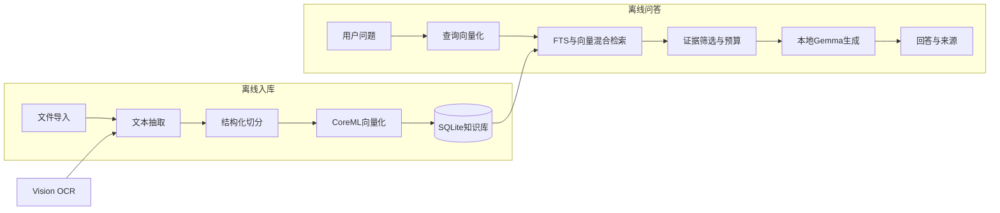

# 本地 RAG 实施记录

> 记录日期：2026-08-12。  
> 状态：核心实现完成；真机发布验收见 [verification.md](./verification.md)。

## 定位

Orynode Mobile AI 是完全独立运行在 iPhone 上的随身私人知识库。文档解析、embedding、索引、检索和回答生成均在设备上完成；运行时无账号、遥测、联网搜索或云端 fallback。

与 [Orynode Local AI](https://github.com/Orynode/orynode-local-ai) 的分工：

- Mac：私有 AI 工作站 / Server，更大模型与资料库。
- Mobile：低门槛导入、即时离线问答、来源核对。
- 首版不自动同步。

`VisionTextRecognizer` 用于扫描 PDF 空页 OCR，并保留为未来拍照文档采集适配器；当前**拍照产品入口**未启用。

## 架构

## 已实现

- Domain 知识库合同、`ImportKnowledgeDocument`、`AskKnowledgeBase`
- 导入 TXT / Markdown / 文本 PDF / Office Open XML（→ Markdown）
- Core ML `multilingual-e5-small` INT8 embedding + SQLite FTS5 / 向量混合检索
- 拒答、引用校验、文档预览与来源跳转
- 知识库 UI、会话历史、检索范围持久化
- App 装配根（`KnowledgeBaseComposition`）；Features 不依赖 Infrastructure
- 10,000 chunks 硬上限；tokenizer 本地加载（不走 `HubApi`）
- 立即入列（`importing`）；分批索引 checkpoint；SHA-256 去重与版本元数据闸门
- `pageSpans` 入库；Ask 收窄在 `CitationLocatorEnricher`（Features 只解析印刷页码）

关键路径：

- `Sources/Domain/KnowledgeBase.swift`
- `Sources/Application/KnowledgeBaseUseCases.swift`
- `Sources/Application/CitationLocatorEnricher.swift`
- `Sources/Infrastructure/SQLiteKnowledgeRepository.swift`
- `Sources/App/KnowledgeBaseComposition.swift`
- `Sources/Features/KnowledgeBase/`

## 相对初版计划的调整

- Core ML embedding 已选定；发布资格仍以真机数据为准。
- 检索融合为 cosine 70% + FTS 30% 加权，非 RRF；是否切换由题集决定。
- 内容哈希为 SHA-256；`content_hash_version` 不匹配则拒绝打开已有索引。
- 分批索引写入 `unpublished_chunks`，checkpoint 随事务提交推进；`publish` 前不可检索，ready 重试保持上一版本服务。
- Ask 引用收窄与 PDF 页锁定在 Application；Features 只解析印刷页码。
- OOXML 复杂表格 / 页眉页脚完整度、PDF 复杂版式高亮精度待加固。

## 待真机验收

见 [verification.md](./verification.md) 与题集目录 [verification/evalset/](./verification/evalset/)。不得因编译成功或单次 smoke 通过标记发布完成。

已有进度：

- 真机飞行模式核心路径已通过（导入 → 索引 → 提问 → 引用）

仍缺正式报告：

- 预注册题集（Recall@5 / MRR@10 / 拒答）
- 10k 容量与恢复
- 内存 / 性能基线冻结
- 发版验收包字段（commit、模型哈希、题集版本等）

## 后续优先级

1. 真机 embedding / 检索 / 拒答题集闸门
2. 10k 真机容量、恢复与内存证明
3. PDF 页内高亮精度
4. 模型分时加载
